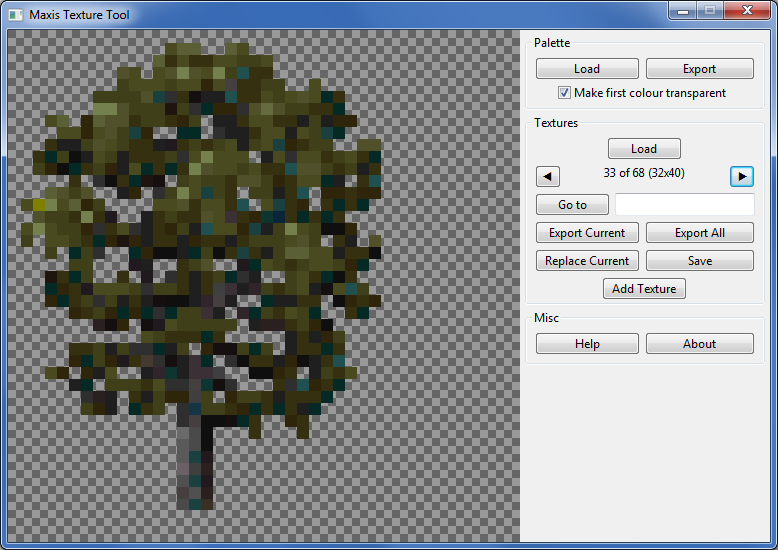

# Maxis Texture Tool

This program can view, export, and replace images contained in Maxis composite bitmap files matching the format of those used to store the textures for [SimCopter](https://en.wikipedia.org/wiki/SimCopter) and [Streets of SimCity](https://en.wikipedia.org/wiki/Streets_of_SimCity).

Recommended for use with [SimCopterX](http://simcopter.net) or [SimStreetsX](http://www.streetsofsimcity.com/), which not only patch both games to ensure reliable operation when run under modern versions of Windows but also ensure that they use local resource files (when installed 1990s-style, both games usually load resource files from their CDs even when the installer has copied them to the hard drive). This means you can modify textures using this program, save a Maxis composite bitmap file with your changes, replace the original file (first making a backup, of course), and see your changes in-game when running via SimCopterX or SimStreetsX.

## Instructions

* Load a palette from a Maxis mesh geometry file.
  * Geometry files are stored in each game's `geo` folder.
  * The palette can be exported as a PNG image or a [GIMP](https://www.gimp.org/) palette file.
* Load a Maxis composite bitmap file.
  * These are stored in each game's `bmp` folder, along with many regular Windows bitmaps.
  * Textures can be exported as PNG images individually or all at once.
  * Textures can be replaced. If the replacement texture contains colours that aren't included in the palette, they will be mapped to the nearest palette colour.
    * It's preferable to export the palette and use it to limit the colours of the replacement texture in suitable image editing software before replacement.
* Save a Maxis composite bitmap file with your changes.
  * Copy your modified file to the game's `bmp` folder, make a copy of the original file, and rename your file appropriately.
    * For example, if you modified `sim3d.bmp`, move or rename it, copy the file with your changes into the `bmp` folder, and rename it `sim3d.bmp`.
  * Run the game via SimCopterX or SimStreetsX and you should see your changes.
* See the in-program help for additional information.